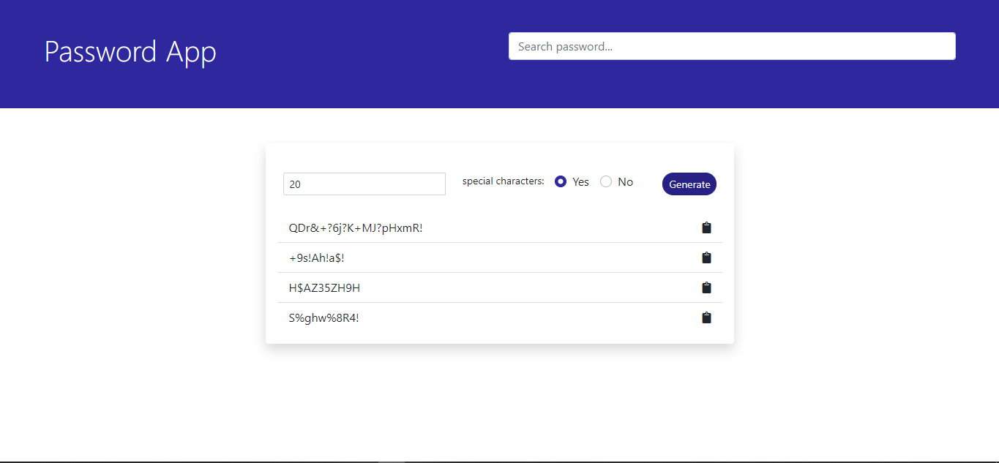

# Password Generator App

## Motivation

The objective of this project is to develop an alternative to this [project](https://github.com/moadams847/Flask-API-Password-Generator/tree/useOOPJS)
which receives JSON data from a flask-based API. This project, however, does not use an API and instead relies on javaScript to generate random characters.

## Screenshot

## URL

[Password Generator App](https://musing-bartik-ad9943.netlify.app/)

## Installation

Clone Repo

## Tech/framework used

1. HTML5
2. CSS3
3. Bootstrap 5
4. SASS
5. Netlify
6. JavaScript/jQuery
7. Local Storage

## Contributing

Pull requests are welcome. For major changes, please open an issue first to discuss what you would like to change.

## License

[MIT](https://choosealicense.com/licenses/mit/)
